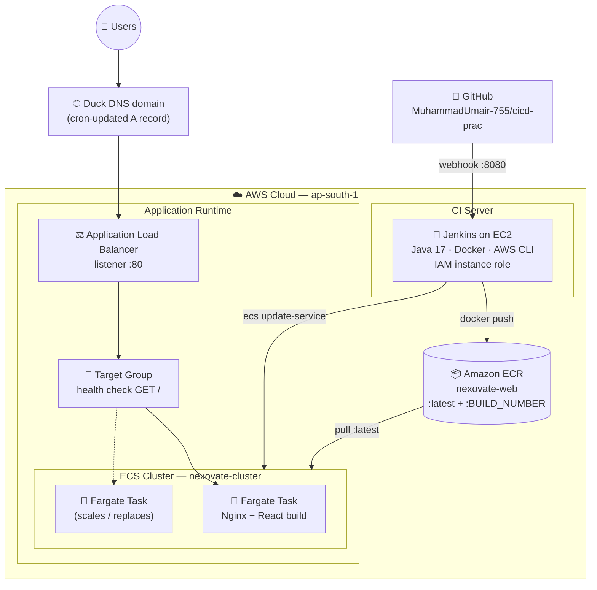
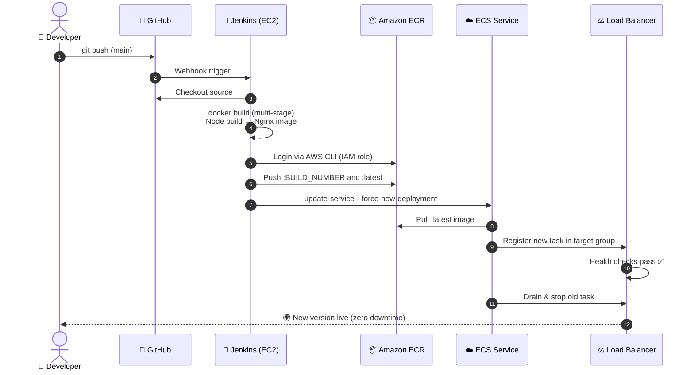
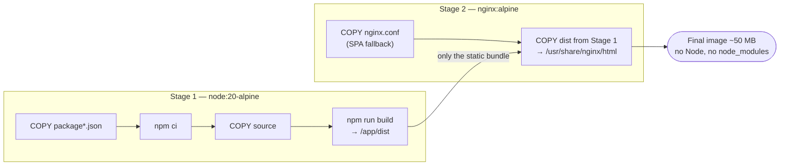

# Nexovate Technologies — React App with Full CI/CD on AWS


A production-style **CI/CD project**: a React website for a fictional software company
(Nexovate Technologies, Lahore, Pakistan), containerized with Docker and deployed to
**AWS ECS** through a fully automated **Jenkins pipeline** — every `git push` goes live
with zero manual steps.

> The React app is intentionally simple (static data, no backend). The real focus of
> this repository is the **DevOps pipeline around it**.

---

## 🏗️ Infrastructure Architecture



**Key design points**

- ECS tasks are **disposable** — every deployment replaces them and their IPs change.
  The ALB is the stable entry point; the ECS service auto-registers new tasks into the
  target group and drains old ones, giving **zero-downtime deploys**.
- The Jenkins EC2 instance uses an **IAM role** (ECR push + ECS deploy) — no AWS keys
  are stored anywhere in Jenkins or the repo.
- Duck DNS can only store IP addresses (no CNAME), so a small **cron script** on the
  EC2 instance re-resolves the ALB's IP every 5 minutes and updates the domain.

---

## 🔄 CI/CD Pipeline Flow



### Pipeline stages (Jenkinsfile)

| Stage | What it does |
| --- | --- |
| **Checkout** | Pulls the latest code from GitHub |
| **Build Docker Image** | Multi-stage build: Node compiles the app, Nginx serves it |
| **Login to ECR** | Authenticates Docker to the private ECR registry via AWS CLI |
| **Push to ECR** | Pushes `:BUILD_NUMBER` (traceability) and `:latest` tags |
| **Deploy to ECS** | Forces a new deployment so ECS rolls out the fresh image |

---

## 🐳 Docker (multi-stage build)



The Nginx config includes an SPA fallback (`try_files ... /index.html`) so React Router
routes like `/about` survive a page refresh, plus long-lived caching for hashed assets.

---

## 🖥️ The Application

React 19 + Vite + React Router v7, plain CSS (no Tailwind, no TypeScript, no backend).
Seven routed pages — Home, About, Services, Projects, Team, Contact, custom 404 — with
all content driven by static data files in `src/data/`. Fully responsive with a mobile
hamburger menu. All company details are fictional; images load from royalty-free URLs.

## 🚀 Run Locally

```bash
# Development
npm install
npm run dev            # http://localhost:5173

# Production build
npm run build
npm run preview

# Docker (same image the pipeline ships)
docker build -t nexovate-web .
docker run -p 8080:80 nexovate-web   # http://localhost:8080
```

## 📁 Repository Structure

```
├── Dockerfile          # Multi-stage build (Node → Nginx)
├── nginx.conf          # SPA fallback + asset caching
├── .dockerignore
├── Jenkinsfile         # CI/CD pipeline definition
├── index.html
├── vite.config.js
└── src/
    ├── main.jsx        # App bootstrap (React + Router)
    ├── App.jsx         # Layout shell + routes
    ├── components/     # Navbar, Footer, cards, shared UI
    ├── pages/          # One component per route
    ├── data/           # All static content (no hardcoding in components)
    └── styles/         # Global CSS variables & shared styles
```

## 🔮 Possible Improvements

- HTTPS via ACM certificate on the ALB (requires a CNAME-capable DNS provider)
- Infrastructure as Code (Terraform) instead of console-built resources
- Pipeline test stage (lint + unit tests) before the Docker build
- Slack/email notifications on pipeline success or failure
- Blue/green deployments with CodeDeploy

---

*Built as a hands-on DevOps learning project — React → Docker → Jenkins → AWS.*
